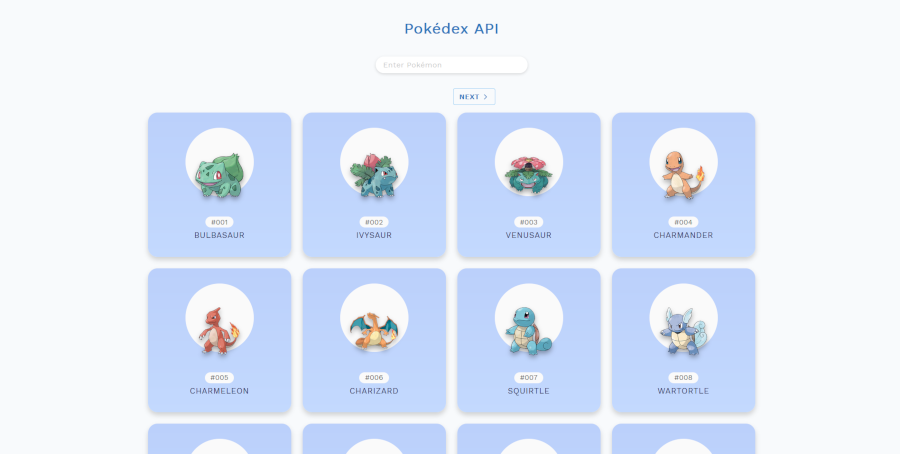
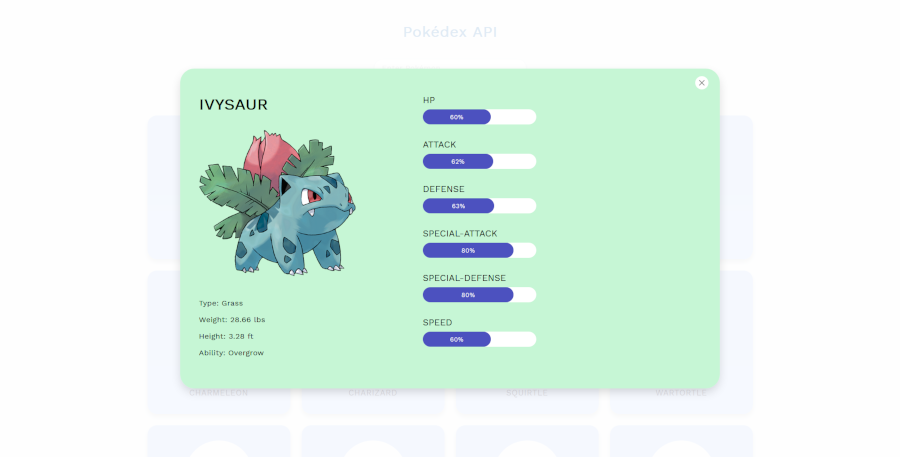

# Pokedex App
Pokedex API

[View Live Demo](https://apcurran.github.io/Pokedex-API/)

## Features:

* Vanilla JS functionality includes:

    * Using the Pokedex API to fetch data

    * Fetch with async/await as an alternative to regular promise syntax

    * Dynamic JS generated HTML for displaying Pokemon cards and Pokemon details modal

    * Real-time search filter for Pokemon

    * Clickable Pokemon cards display a separate pop-up modal with detailed information on a specific character

* CSS Grid and Flexbox used throughout

* Mobile-friendly layout

Having some fun using vanilla JS with Pokemon characters!